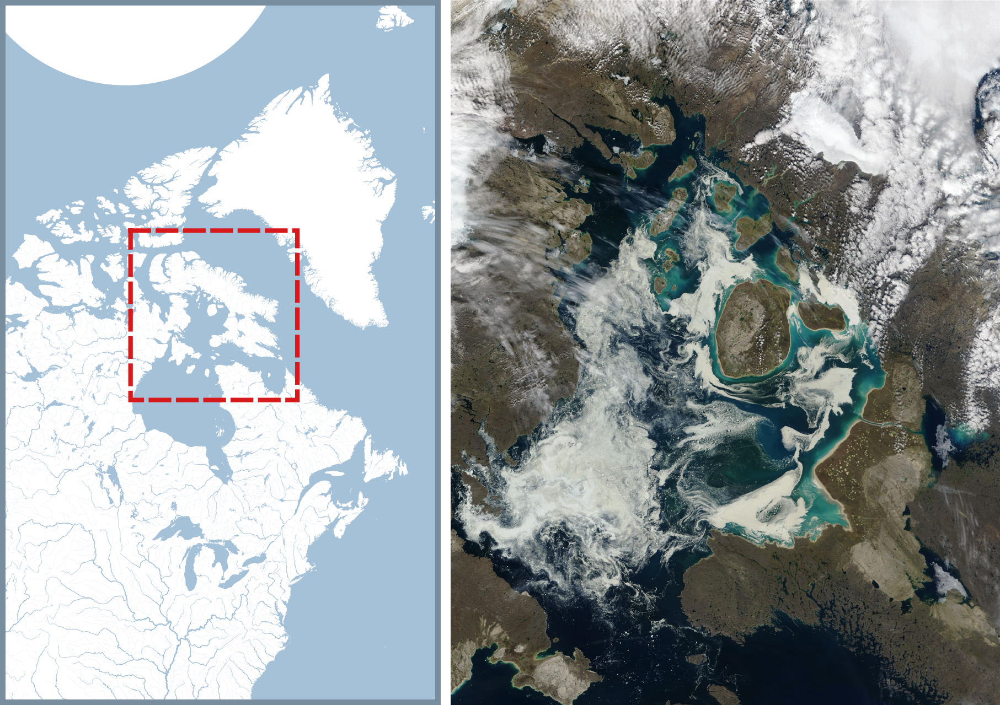

# Analyzing Bowhead Whale movement in Foxe Basin using

The **Baleana mysticetus**, commonly referred to as the *Bowhead whale*, is a species of whale that is indigenous to arctic and subarctic regions. It is believed to hold the distinction of being the mammal with the **longest lifespan** on Earth, with individuals living for over 200 years. With a length of up to **20 meters** and a weight of up to **100 tons**, the Bowhead whale is the **largest animal** in the Arctic.

This species is classified as a **baleen whale**, utilizing a **filter-feeding system** to feed on plankton and small fish. Additionally, the Bowhead whale is a **migratory species**, annually traveling from the Arctic to the subarctic regions and vice versa.

Unfortunately, the Bowhead whale is currently an **endangered species**, with a population of only **10,000 individuals**.

 

<b>Bowhead whale adult with calf</b>
 

<i>Image source: https://www.fisheries.noaa.gov/species/bowhead-whale</i>
 

The **Foxe Basin** is a shallow oceanic basin located in the eastern Canadian Arctic, bounded by the *Melville Peninsula* to the east and the *Baffin Island* to the west. It is connected to the Hudson Bay through the *Hudson Strait*, and to the Labrador Sea through the *Fury and Hecla Strait*.

The basin has a diverse ecosystem that includes various **marine mammals**, such as *polar bears*, *narwhals*, and *beluga whales*, as well as several species of fish and seabirds. The Foxe Basin is also an important area for **Inuit communities**, who rely on its natural resources for their subsistence and cultural practices.

- **Location**: eastern Canadian Arctic
- **Boundaries**: Melville Peninsula (east), Baffin Island (west)
- **Connections**: Hudson Bay (through Hudson Strait), Labrador Sea (through Fury and Hecla Strait and the Gulf of Boothia)
- **Ecosystem**: diverse, including marine mammals (polar bears, narwhals, beluga whales, bowhead whales), fish, and seabirds
- **Importance**: critical to Inuit communities for subsistence and cultural practices.

 

<b>Study area map with sattelite imagery of Foxe Basin</b>
 

<i>Image source: Jacques Descloitres, MODIS Land Rapid Response Team,NASA/GSFC/</i>
 

# Data Source & References

## Data
https://www.movebank.org/cms/webapp?gwt_fragment=page=studies,path=study467031755

## References
https://mmru.ubc.ca/2020/06/bowhead-whales-adjust-their-feeding-behaviour-over-seasonal-in-cumberland-sound-nunavut/
https://waves-vagues.dfo-mpo.gc.ca/library-bibliotheque/364045.pdf